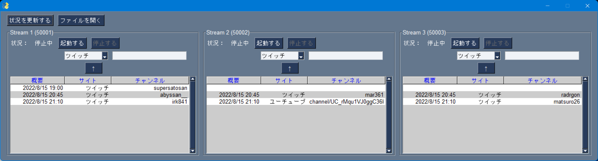
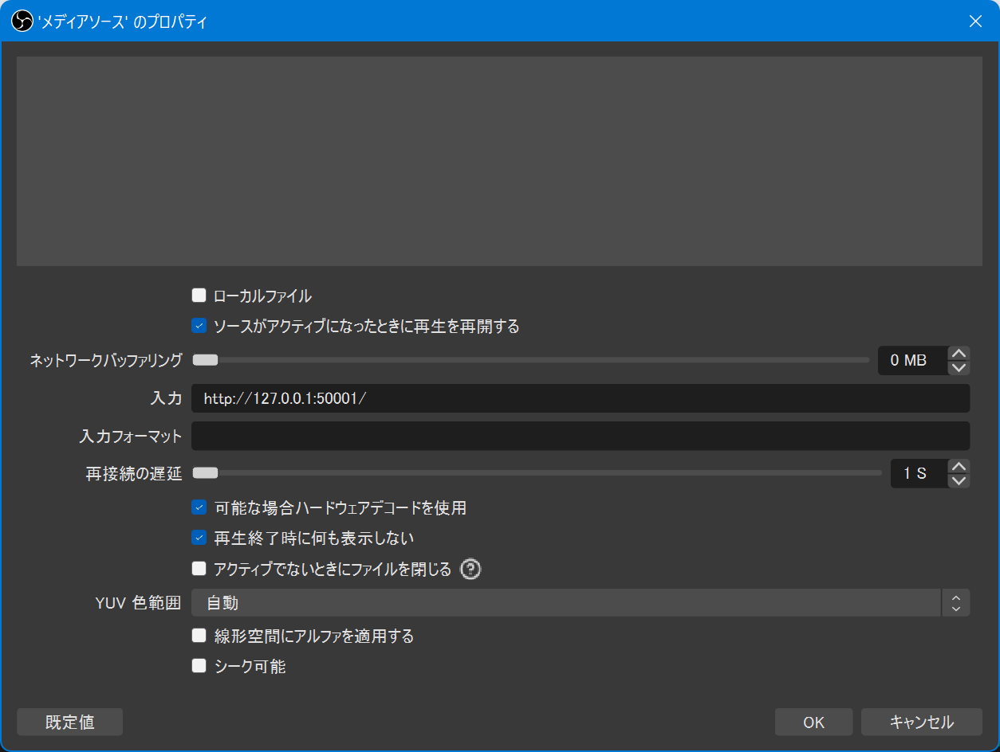

## はじめに
4
C#で見た目も中身の設計もきれいに作り直したい…　あるいは誰か作って……
5
​
6
## できること
7
本アプリとOBSとStreamlinkを使用することで、複数の配信の同時ミラー配信が簡単にできます。
8
​
9
同時ミラー配信数を増やすと本アプリの画面が縦長になるので、表示上、6つが限界だと思います。
10
​
11

12
​
13
​
14
## 動作環境
15
- Windows 11
16
    - Windows 10 64bit版でも動くと思います
17
- [Streamlink (Windows installer builds)](https://github.com/streamlink/windows-builds/releases) (64bit版)
18
    - exe版のインストールを想定していますが、zip版でも後述の `streamlink.exe` のパスを適切に設定すると動くと思います
19
    - `py310` ( `Python 3.10` ベース) か `py38` ( `Python 3.8` ベース) かは、どっちでもよさげ
20

​
21
## ダウンロード方法
22
- exe版を使用する場合: 右のReleasesから `streamlink-changer-py-vX.Y.zip` ファイルをダウンロードください
25
- スクリプト版を使用する場合: 右のReleasesから ソースコードをダウンロードするなり、本リポジトリーをクローンするなりしてください
26

## 使用方法
22
### 本アプリ
23
#### 実行ファイル
24
- exe版を使用する場合: `streamlink-changer-py.exe` を実行
25
- スクリプト版を使用する場合: Pythonで `Code\main.py` を実行
26
    - `Python 3.9` で動作確認
27
​
28
#### 設定ファイル ( `streamlink.jsonc` )
29
`streamlink-changer-py.exe` ないし `Code\main.py` と同じフォルダーに置いてください。
30
​
31
基本的には変更する必要はありません。以下を見て必要があれば変えてください。
32
​
33
- `"streamlinkPath"`: PowerShellないしコマンドプロンプトから `streamlink.exe` を起動する際のコマンドが設定されています。デフォルト値は、`streamlink.exe` のあるフォルダーにパスが通っていることを想定して `"streamlink.exe"` としています。zip版のStreamlinkをダウンロードした場合や、 `streamlink.exe` のあるフォルダーにパスが通っていない場合は、絶対パスで記載してください。
34
- `"portsFrom"`: ミラー元の配信のローカルへのリダイレクト先となる、ローカルホストのポートの開始番号です。デフォルト値は `50001` としており、 `50001, 50002, ..., (最大ミラー数ぶんだけ)` ポートを連番で使用します。不都合がある場合はほかの番号に変更してください。
35
- その他: `streamlink.exe` に渡すオプション引数が記載されています。
36
​
37
文字コードは `UTF-8 without BOM` です。
38
​
39
​
40
#### ミラー元ファイル ( `streams.csv` )
41
アプリ画面の `ファイルを開く` で選択してください。デフォルトでは3並走までの例を記載しています。4並走の場合は、
42
`Stream4_概要,Stream4_サイト,Stream4_チャンネル` 列を増やしてください(5並走以上も同様)。
43
​
44
文字コードは `UTF-8 **with** BOM` です（変えても動くと思います）。


### OBS
メディアソースでローカルホストの指定ポートを設定することで、ローカルへリダイレクトされているミラー元の配信をOBSで取り込みます。具体的には以下の手順で取り込みます。
1. `ソース` → `追加` → `メディアソース` で、メディアソースを追加
2. メディアソースのプロパティで、以下を設定
    - `ローカルファイル` のチェックを外し、
        - `ネットワークバッファリング` の値を小さくする?
        - `入力` に **`http://127.0.0.1:数字/`** と入れる
            - `数字` は、設定ファイル ( `streamlink.jsonc` ) の `"portsFrom"` の値を変更していなければ、ミラー元の1つ目は `50001`, 2つ目は `50002`, ...
        - `再接続の時間` の値を小さくする?
    - `可能な場合ハードウェアデコードを使用` のチェックを入れる
3. ミラーする配信の数だけぶんだけ、1., 2.を繰り返す




## 既知の不具合
- `streamlink-changer-py.exe` を実行して立ち上がるPowerShellないしコマンドプロンプトを閉じても、アプリが終了せず、起動中の配信1つだけが終了する場合がある


## どうしても動かない場合
- 本アプリを使わず、PowerShellないしコマンドプロンプトでStreamlinkを動かし、ミラー元の配信のローカルへリダイレクトしてください

Twitch配信をミラーする場合
```
streamlink.exe --loglevel info --player-external-http --default-stream "720p60,720p,480p60,480p,360p60,360p,best,worst" --retry-streams 5 --retry-max 2 --retry-open 2 --stream-timeout 15 --twitch-disable-ads --twitch-disable-hosting --twitch-disable-reruns --twitch-low-latency --url https://www.twitch.tv/チャンネル名 --player-external-http-port ポート番号
```

YouTube配信をミラーする場合
```
streamlink.exe --loglevel info --player-external-http --default-stream "720p60,720p,480p60,480p,360p60,360p,best,worst" --retry-streams 5 --retry-max 2 --retry-open 2 --stream-timeout 15 --url https://www.youtube.com/channel/チャンネル名/live --player-external-http-port ポート番号
```

niconico配信をミラーする場合
```
streamlink.exe --loglevel info --player-external-http --default-stream "720p60,720p,480p60,480p,360p60,360p,best,worst" --retry-streams 5 --retry-max 2 --retry-open 2 --stream-timeout 15 --url https://live.nicovideo.jp/watch/チャンネル名 --player-external-http-port ポート番号
```

- Streamlinkを終了させる場合は、PowerShellないしコマンドプロンプトを閉じる、タスクマネージャから殺す、などしてください
- OBS側の設定は変わりません


## 作者用メモ
### exe版の生成
`Pyinstaller` フォルダーをカレントディレクトリにして、 `pyinstaller --clean --onefile --name streamlink-changer-py ../Codes/main.py` をする
